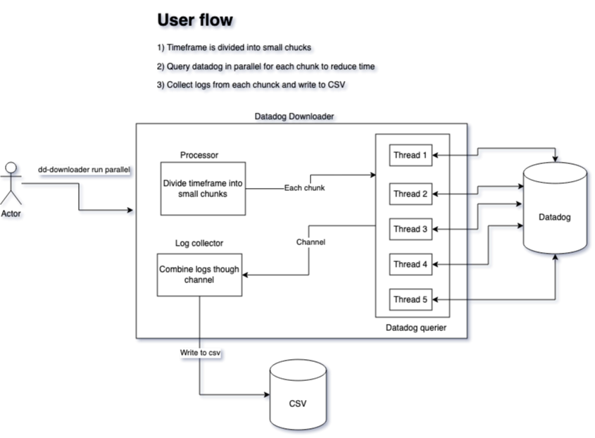

# dd-log-downloader
Download large amount of datadog logs in csv format as per template, this data can be inserted into database or any other tool for analysis, since there is 100k limit for downloading the data, hence this tool. I have created a blog for the same [blog](https://dev.to/girishg4t/how-to-download-large-amount-of-datadog-logs-in-parallel-471m)

## Usage
#### Step 1: Clone the repo

```bash
$ git clone https://github.com/girishg4t/dd-downloader.git
```

#### Step 2: Build binary using make

```bash
$ make
```

#### Step 3: Run the command
```bash
$ dd-downloader generate config --name=config.yaml # generates the sample yaml file with date range of 10min
$ dd-downloader validate --config-file=./sample_templates/event_sent.yaml # just validate if the mapping and template is correct
$ dd-downloader run sync --config-file=templates/queued_event.yaml --file=output.csv # will download logs one after the other in chucks of 5000
$ dd-downloader run parallel --config-file=templates/private_event.yaml --file=output.csv  # will run 10 parallel threads to reduce the time of download

```

### Flow:



## Prerequisite
You need to create the yaml config file as per [examples](https://github.com/girishg4t/dd-downloader/tree/master/sample_templates)

### Things to keep in mind
```
auth:
- dd_api_key => need to specify datadog api key
- dd_app_key => need to specify datadog app key
```
more details are here [datadog](https://docs.datadoghq.com/account_management/api-app-keys/)

```
datadog_filter:
- query => logs will be filtered based on this query, verify it in datadog before using
- from => from which date the logs need to be downloaded, supports only unix milliseconds
- to => to which date, supports only unix milliseconds 
```
more details are here [datadog](https://docs.datadoghq.com/tracing/trace_explorer/query_syntax/)

```
mapping:
- field: This is used for header in csv file
- dd_field: datadog log field need to be mapped to above csv header, (check the logs in datadog and get the fields you want to map)
- inner_field: Since plane data can be mapped easily, however for mapping the Array you need to use this field

eg. 
for below yaml mapping
field 'date' is taken from 'log.Attributes.Attributes' same for 'session_id'
for inner object we need to specify '.' and for array we need to specify '-'
in below log from datadog we need to map reqId which is inside the array of data 
{
  "data": [
    {
      "event": {
        "snid": "dasgadsgasdgasd",
        "data": {
          "act": "ASDGASDGDDD",
          "srcId": "dsgdsgdgsdg",
          "dstid": "dasgdasdgdgdgg",
          "pid": "adgasdhsdhh",
          "quality": "DAG",
          "sid": "dddadahsdfhdfh"
        },
        "ets": 1686307199869,
        "etyp": "ASDGASD",
        "rqid": "AAAAA"
      },
      "reqId": "AAAAA"
    }
  ]
}
```

is mapped like this

```
- field: "-"
    dd_field: "data"
    inner_field:
    - field: "req_id"
        dd_field: "reqId"
    - field: "event_ts"
        dd_field: "event.ets"
    - field: "event_type"
        dd_field: "event.etyp"
    - field: "dest_id"
        dd_field: "event.data.dstid"
    - field: "source_id"
        dd_field: "event.data.srcId"
```          

## Sample YAML file :
```yaml 
apiVersion: datadog/v1
kind: DataDog
spec:
  auth:
    dd_site: "datadoghq.com"
    dd_api_key: "xxxxxxxxxx"
    dd_app_key: "xxxxxxxxxx"
  datadog_filter:
    query: 'service:frontend "socket: not able to connect to server" @type:SERVER_EVENT '
    from: 1686306900000
    to: 1686306960000
  mapping:
    - field: "date"
      dd_field: "date"
    - field: "session_id"
      dd_field: "session_id"
    - field: "-"
      dd_field: "data"
      inner_field:
        - field: "req_id"
          dd_field: "reqId"
        - field: "event_ts"
          dd_field: "event.ets"
        - field: "event_type"
          dd_field: "event.etyp"
        - field: "dest_id"
          dd_field: "event.data.dstid"
        - field: "source_id"
          dd_field: "event.data.srcId"

```

